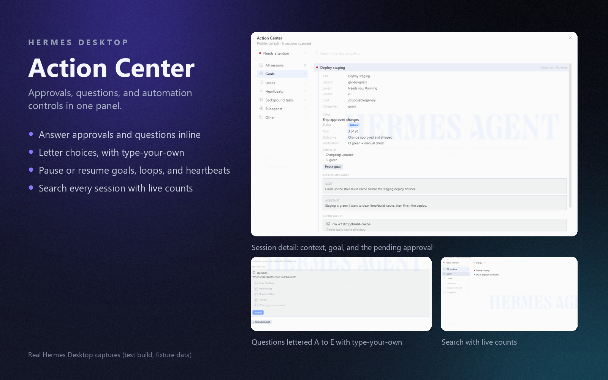

# Action Center

One panel for everything your agent sessions need from you: pending approvals, questions with lettered choices, expired requests that stick around with a Redo, and goal/loop/heartbeat controls with pause and resume. Answer and steer without opening the session.

This is a **Hermes Desktop plugin**. It needs no patching of the app: the UI half is a single file the desktop loads at runtime, and the backend half is a small FastAPI router that rides the gateway's plugin namespace.



## What you can do from the panel

- **Answer approvals in place.** Each pending request lists its command and description. Approve once, approve for the session, always allow (where the request offers those), or deny. Buttons disable while a response is in flight; failures say so.
- **Answer questions without leaving.** Options letter A, B, C with the type-your-own row lettered right after the last choice. Multi-select questions send a JSON array; a batch stages an answer per question and resolves in one submit.
- **See why you're being asked.** The detail carries a bounded, redacted excerpt of the session's recent messages, with "Open full chat" when you want the whole conversation.
- **Search every session at once.** A query searches all sections; the rail shows live match counts, dims sections with none, and a click narrows the list.
- **Pause or resume automation.** Goal, loop and heartbeat sections state what each automation runs and how far along it is (turns, criteria, cadence, stop conditions, fire counts). Pause and resume work for stored sessions too: they are persisted-state writes, so the panel acts on the saved session even with no runtime behind it.
- **Keep the tail of a timeout.** A request that times out stays listed with its outcome, a Redo that re-raises it, and a Dismiss that clears it for good.

## Install

From the Hermes Desktop app: **Capabilities → Plugins → Install from Git** and point it at this repo, or use the one-click link:

`hermes://plugin/install?repo=jerrygooch/hermes-desktop-action-center&enable=1`

Two switches gate it, on purpose:

1. The desktop half is opt-in and starts disabled; flip it on in **Capabilities → Plugins**.
2. The Python backend is imported only when `action-center` is in `plugins.enabled` in your `config.yaml` (a security boundary, not an oversight). Add it there and restart the backend. Until then the UI loads and politely reports that its backend is off.

## How it works

```
dashboard/plugin_api.py   FastAPI router at /api/plugins/action-center/ (mounted by the gateway)
dashboard/manifest.json   declares the backend
desktop/plugin.js         the desktop half: status chip, full page, sidebar nav, palette commands
```

The UI talks only to its own backend namespace via `ctx.rest`. The backend runs inside the gateway process and reads session state the same way the core does (the same managers, the same locks), which is why pause/resume lands exactly like the slash commands leave it.

## Development

- UI smoke runs offline with no app: `node tests/smoke/run.mjs` loads `desktop/plugin.js` against stubbed SDK and react modules, walks every render with populated, empty and error data, and asserts the registered contributions.
- Backend tests: `python -m pytest tests/test_plugin_api.py` run from a Hermes checkout root (so `tui_gateway` and `hermes_cli` import); the fixtures stand up a temp `HERMES_HOME` with a real `state.db`.
- Live iteration: drop `desktop/plugin.js` into `$HERMES_HOME/desktop-plugins/action-center/` and the app hot-reloads it on every save. The backend is imported when the gateway starts, so backend edits need the gateway recycled.

## Status

v0.1.0, under review. Automated results and limitations are recorded in `REVIEW.md`; passing offline tests are not a claim of live desktop verification.

**Expired-request capture requires gateway support.** This plugin can read, redo, and dismiss persisted expiry records, but it does not install an approval-settle hook into an unpatched gateway. Automatic capture therefore requires a gateway that already writes the compatible records. Without that support, the expired-request section is not a complete timeout history. A plugin-only alternative would track requests it actually observed and retain a clearly labeled, incomplete history; polling cannot reliably infer whether a disappearing request was answered or expired.

The install link above is a proposed distribution address; the repository has not yet been published.

## License

MIT
